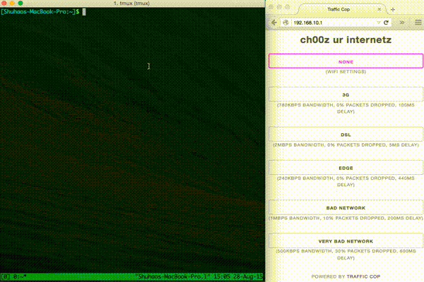

## trafficcop

###Basic Idea/Motivation
* The idea is to allow people to connect to a wifi hotspot and then immediately be able to simulate shitty mobile network connections.
* Lets developers easily test application performance with on slow connection in mind
* Relates to “mobile first” thinking by acknowledging “mobile first” means connections that are not always as reliable/speedy/generally good (i.e. 💩).

### Official Supported Device:

* TL-WR703N: http://www.dx.com/p/tp-link-tl-wr703n-mini-3g-2-4ghz-802-11b-g-n-150mbps-wireless-router-blue-158552

###Specification

* Ability to introduce extra:
 * Latency (delay)
 * Packet loss
 * Bandwidth limitations
 * Per device address throttling → i.e. web interface such that you can go and adjust the setting for your client only.

Accessible at `http://<router ip>:8080`

### Installation ###

Although I've only tested this on a TL-WR703N, this should work on any device that uses `br-lan` as its LAN interface.

To install this, download the ipk package from releases into your /tmp and then run:

    # opkg update
    # opkg install trafficcop-*.ipk
    # modprobe sch_netem

This should install and start trafficcop on 8080 with uhttpd on the ip address for the interface `br-lan`. If you're unsure what IP this is, you can run the following to find out:

    # ifconfig br-lan | grep 'inet addr' | cut -d ":" -f 2 | cut -d " " -f 1

This means you can access traffic cop at `http://<router ip>:8080`. 

Installation location:
    # /usr/lib/trafficcop
